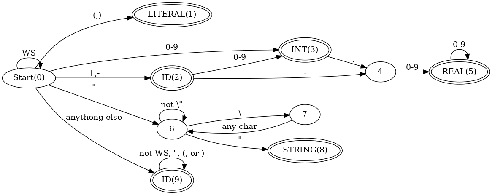

# Project 2

Implement a parser Lisp(ish) in CSharp. 

For this project you will write `lispish.exe`, an parser for a simple LISP-like language. 

Your program will read a LISP expression and print the parse tree.  

> NOTE:  I created a video demonstrating me solving a similar problem in c-sharp at [this link](https://youtu.be/jgQONmpCQ-c).  The files are in this repo. 


## Getting Started
1. Clone your fork 
1. Type `make update`  to get the latest version of the assignment 
1. Type `make check` to check your work by running the tests. 
1. Do not submit work that does not pass the checks.
2. When finished, type `make submit` or `git commit -am "done" && git push` to upload your latest changes.
3. Look online at your gitlab fork to confirm that your submission was correct.  

# Overview
Consider the following grammer for a simplified scheme grammar

```
<Program> ::= {<SExpr>}
<SExpr> ::= <Atom> | <List>
<List> ::= () | ( <Seq> )
<Seq> ::= <SExpr> <Seq> | <SExpr>
<Atom> ::= ID | INT | REAL | STRING
```
 

The token types are described by the following regular expressions (use [regex101.com](https://regex101.com/) to explore them):

- `LITERAL` = [[\\(\\)]](https://regex101.com/r/YTsgaN/1)
- `REAL` = [[+-]?[0-9]*\\.[0-9]+](https://regex101.com/r/Zneyy2/1)
- `INT` = [[+-]?[0-9]+](https://regex101.com/r/iXVsuF/1)
- `STRING` = ["(?>\\\\.|[^"])*"](https://regex101.com/r/NvtTXK/1).  Multiline strings are not allowed. 
- `ID` = [[^\s"\(\)]+](https://regex101.com/r/PeL1IV/1/)
- Anything else other than whitespace is an error ( `INVALID`)

You may use these `Regex` patterns to design your own lexer based on a state diagram as we did in the lab, or you can use the C# `Regex.Match` method to scan the input for matches, taking care to skip whitespace and handle newline appropriately. When designing a tokenizer, the first pattern that matches the input string starting from the current position should be the one that you use.


You may notice that '+', '-', '*',  '/', '=', '<', and '>' are identifiers in our language. 


Here is a diagram I put together quickin in Spring2022 - let me know if you find an error:


## Tokenization

Each time your program reads a LISPish program, you will print all of the tokens and lexemes. Each token will be displayed on its own line, the token type will be displayed with a field-width of 20 characters, followed by the lexeme (the text of the token). 

Please refer to the file to the examples in [./example1.expected](./example1.expected) through [./example7expected](./example1.expected) to get a precise idea of what the output should be. 


## Parse Tree
You will create a _LispishParser_ class, and also _LispishParser.Node_ class, that represents a node in a parse tree.
Your program will take as input the sourcecode to a LISPish program.  
You will tokenize the sourcecode to produce a sequence of Nodes. 
Then you will write a _Recursive Descent Parser_ that constructs a parse tree.

Similar to our lab, you will define a method named _Node.Dump(string prefix)_ within your _Node_ class, that takes a _prefix_ string and then it will print the _Node_'s symbol preceeded by the prefix. Then it will add another two spaces to the prefix string, and recurively call _Print_ for each of it's child nodes. A leaf node (with no children) will display the text of the node instead of displaying its children.  


Please refer to [example1.input](example1.input) and [example1.expected](example1.expected) for examples of the output the should be produced for corresponding input. 

# Submission
Type `make submit` to submit the assignment. 
